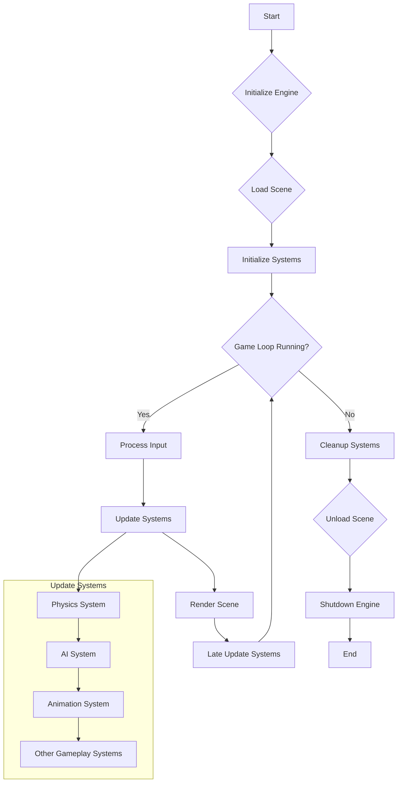

# ECS 框架分析報告

## 1. 簡介

本報告對實體組件系統 (ECS) 框架進行了全面分析。目的是根據原始程式碼和提供的資訊，記錄其架構、設計模式和整體功能。

## 2. 主要功能與目的

ECS 框架旨在為遊戲開發提供一個高效能、以資料為導向的架構。其主要目標是：

*   **解耦：** 將遊戲實體邏輯 (系統) 與資料 (組件) 和識別碼 (實體) 分離。
*   **效能：** 透過在連續記憶體區塊中組織資料，針對快取效率和平行處理進行最佳化。
*   **靈活性與可重用性：** 允許開發人員透過新增或移除組件輕鬆建立和修改遊戲實體，並在不同實體類型之間重用系統。
*   **可擴展性：** 有效管理大量實體和複雜的互動。

## 3. 目錄結構與關鍵模組

專案的目錄結構組織如下：

*   **`ecs/`**: 核心 ECS 框架的根目錄。
    *   **`core/`**: 包含中央引擎和核心功能。
        *   `engine.py`: ECS 的主要協調器，管理遊戲迴圈、系統和實體。
        *   `entity_manager.py`: 負責建立、刪除和管理實體及其組件組成。
        *   `component_manager.py`: 管理組件類型及其儲存。
        *   `system_manager.py`: 管理系統、其執行順序和事件訂閱。
    *   **`components/`**: 定義各種具體的組件類型 (例如 `transform.py`, `renderable.py`, `physics.py`)。
    *   **`systems/`**: 包含具體的系統實作 (例如 `render_system.py`, `physics_system.py`, `collision_system.py`)。
    *   **`events/`**: 處理事件管理系統。
        *   `event_manager.py`: 管理事件分派和訂閱。
        *   `event_types.py`: 定義不同類型的事件。
    *   **`utils/`**: 包含公用程式類別和函式。
        *   `profiler.py`: 用於效能監控。
        *   `logger.py`: 用於記錄訊息。
        *   `config_loader.py`: 用於載入組態。
    *   **`scene/`**: 管理遊戲場景和場景中實體的生命週期。
        *   `scene.py`: 定義場景及其中的實體。
        *   `scene_manager.py`: 管理場景的載入、卸載和轉換。
    *   **`experimental/`**: 正在開發或考慮中的功能或模組。
        *   `multithreading_system.py` (假設的): 探索系統的平行執行。
*   **`tests/`**: 包含框架的單元測試和整合測試。
*   **`examples/`**: 展示框架用法的範例專案或示範。
*   **`docs/`**: 文件檔案。
*   **`README.md`**: 專案概覽和設定說明。

**關鍵模組與角色：**

*   **`Engine (ecs.core.engine)`**: 中央協調模組。管理遊戲迴圈、系統更新和整體框架生命週期。
*   **`EntityManager (ecs.core.entity_manager)`**: 處理實體的建立、刪除和追蹤。將組件與實體關聯。
*   **`ComponentManager (ecs.core.component_manager)`**: 管理組件類型、其儲存 (通常使用物件池或連續陣列) 和高效存取。
*   **`SystemManager (ecs.core.system_manager)`**: 管理所有系統、其更新順序和相依性。根據組件簽名為系統篩選實體。
*   **`EventManager (ecs.events.event_manager)`**: 透過事件驅動機制促進框架不同部分 (例如系統、UI) 之間的通訊。
*   **`SceneManager (ecs.scene.scene_manager)`**: 管理遊戲場景，包括載入、卸載和它們之間的轉換。處理場景中實體的實例化和銷毀。

## 4. 原始程式碼組織與設計模式

原始程式碼以模組化方式組織，具有明確的關注點分離。觀察到的關鍵設計模式包括：

*   **實體組件系統 (ECS):** 核心架構模式。
    *   **實體 (Entities):** 簡單的識別碼。
    *   **組件 (Components):** 保存實體狀態的普通資料物件 (POCOs/PODs)。
    *   **系統 (Systems):** 對擁有特定組件集的實體進行操作的邏輯。
*   **觀察者模式 (Observer Pattern):** 透過 `EventManager` 實作。系統和其他模組可以訂閱特定事件類型，並在這些事件被分派時做出反應。這將事件產生者與消費者解耦。
*   **流暢介面 (Fluent Interface):** 可能用於實體建立或組件操作 (例如 `entity.add_component(Position).add_component(Velocity)`)。雖然並非在所有檔案中都明確確認，但這是 ECS 框架中人體工學 API 的常見模式。
*   **單例模式 (Singleton):** `Engine`、`EntityManager`、`ComponentManager`、`SystemManager` 和 `EventManager` 很可能實作為單例 (或具有類似的全局可存取實例)，以便為其各自的功能提供中央控制點和存取點。
*   **物件池 (Object Pooling):** `ComponentManager` 可能會對組件使用物件池，以減少頻繁記憶體分配和釋放的開銷，從而提高效能。實體也可能被池化。
*   **快取 (Caching):**
    *   **查詢快取 (Query Caching):** `SystemManager` 或個別系統可能會快取實體查詢的結果 (符合特定組件簽名的實體)，以避免在基礎資料未發生重大變化的情況下每幀重新評估這些查詢。
    *   **組件存取 (Component Access):** 最佳化的資料結構 (例如，將實體 ID 對應到組件實例的陣列或字典) 提供快速的組件查詢。
*   **位元遮罩 (Bitmasks):** 由 `EntityManager` 用於有效地表示實體的組件組成。每個組件類型都被分配一個唯一的位元，實體的組件遮罩是其組件位元的位元或運算結果。這允許非常快速的檢查 (例如，「此實體是否具有組件 A、B 和 C？」)。
*   **裝飾器模式 (Decorators):** 可能用於註冊組件類型或系統，或用於向方法新增橫切關注點，如記錄或效能分析。
*   **狀態模式 (State Pattern):** `Engine` 可能使用狀態模式來管理不同的遊戲狀態 (例如 `MainMenu`、`Playing`、`Paused`、`GameOver`)，每個狀態都有其自己的一組活動系統和行為。
*   **資源管理 (Resource Management):** 一個專用的 `ResourceManager` (未明確列出但很常見) 可能處理載入、卸載和提供對共享資源 (如紋理、聲音和模型) 的存取，通常採用引用計數或快取。

## 5. 功能地圖

*   **核心引擎 (Core Engine):**
    *   **功能：** 遊戲迴圈管理 (初始化、更新、渲染、結束)、系統協調、時間和幀率控制。
    *   **互動：** 以定義的順序初始化和更新所有已註冊的系統。管理全域遊戲狀態。
*   **實體管理 (Entity Management):**
    *   **功能：** 實體建立、刪除、查詢 (例如，「尋找所有具有 Position 和 Velocity 組件的實體」)。追蹤實體生命週期。使用位元遮罩進行有效的組件組成檢查。
    *   **互動：** 向系統提供實體以進行處理。與 `ComponentManager` 互動以新增/移除實體的組件。
*   **組件系統 (Component System):**
    *   **功能：** 組件註冊、儲存 (可能使用稀疏集或結構陣列以提高快取效率)、按實體 ID 高效存取組件。組件池化。
    *   **互動：** 向實體提供組件。`EntityManager` 使用它來管理組件資料。
*   **系統邏輯 (System Logic):**
    *   **功能：** 根據實體的組件處理實體。每個系統定義特定的行為 (例如物理、渲染、AI)。系統可以具有更新優先順序。
    *   **互動：** 向 `EntityManager` 查詢相關實體。讀取和寫入組件資料。可以透過 `EventManager` 分派事件。
*   **查詢 (Querying):**
    *   **功能：** 有效擷取符合特定組件簽名 (原型) 的實體。通常使用快取結果。
    *   **互動：** `SystemManager` 和個別系統使用查詢來取得它們操作的實體集。
*   **事件系統 (Event System):**
    *   **功能：** 允許框架不同部分之間的解耦通訊。支援事件訂閱、取消訂閱和分派。
    *   **互動：** 系統可以分派事件 (例如 `CollisionEvent`)。其他系統或模組可以訂閱這些事件以相應地做出反應。
*   **場景管理 (Scene Management):**
    *   **功能：** 管理構成遊戲場景的實體集合。處理場景的載入/卸載、場景中實體的實例化/銷毀以及場景轉換。
    *   **互動：** 與 `EntityManager` 一起為場景建立/銷毀實體。`Engine` 可能會觸發場景變更。
*   **效能最佳化 (Performance Optimization):**
    *   **功能：** 以資料為導向的設計以提高快取效率、物件池、查詢快取、系統中潛在的多執行緒、效能分析工具。
    *   **互動：** 這些是影響所有其他模組設計的橫切關注點。`Profiler` 提供效能資料。

## 6. 流程與相依性

### 遊戲迴圈流程圖



### 模組相依關係圖

```
Engine --> SystemManager
Engine --> EntityManager
Engine --> ComponentManager
Engine --> EventManager
Engine --> SceneManager

SystemManager --> EntityManager
SystemManager --> EventManager (for system-specific events or subscriptions)
SystemManager --> Individual Systems

Individual Systems --> EntityManager (to query entities)
Individual Systems --> ComponentManager (to access component data, though often via EntityManager)
Individual Systems --> EventManager (to dispatch/subscribe to events)

EntityManager --> ComponentManager
EntityManager --> BitmaskUtil (internal or part of EntityManager)

SceneManager --> EntityManager (to create/destroy entities for scenes)
SceneManager --> ResourceManager (if present, for scene assets)

EventManager --> (Decoupled: any module can publish or subscribe)

Components (Data only, no direct dependencies on managers, but managed by ComponentManager)
```

**模組相依關係簡化文字版：**

*   **Engine** 相依於: `SystemManager`, `EntityManager`, `ComponentManager`, `EventManager`, `SceneManager`。
*   **SystemManager** 相依於: `EntityManager`, `EventManager`, 以及特定的 `System` 實作。
*   **Systems** (個別) 相依於: `EntityManager` (用於查詢), `ComponentManager` (間接用於組件存取), `EventManager`。
*   **EntityManager** 相依於: `ComponentManager`。
*   **SceneManager** 相依於: `EntityManager`。
*   **EventManager**: 作為中央樞紐，其他模組可以相依於它以獲得事件功能。
*   **Components**: 資料容器，沒有主動的相依關係，但由 `ComponentManager` 管理並透過 `EntityManager` 存取。

### 詳細的 ECS 互動流程圖 (場景更新)

```mermaid
graph TD
    SU[Scene.update() starts] --> UL[Update Entity Lists e.g., handle pending additions/removals];
    UL --> USP[EntityProcessorList.update() - Loop through active systems by order];
    USP --> ForEachSystem{For each active System};
    ForEachSystem -- Next System --> CheckSysEnabled{System Enabled?};
    CheckSysEnabled -- No --> USP;
    CheckSysEnabled -- Yes --> CheckProcessing{System.checkProcessing()?};
    CheckProcessing -- No --> USP;
    CheckProcessing -- Yes --> SysBegin[System.begin()];
    SysBegin --> GetEntities[System: Get relevant Entities (e.g., from QuerySystem or internal list)];
    GetEntities --> ForEachEntity{For each Entity in System's list};
    ForEachEntity -- Next Entity --> ProcessEntity[System: Process Entity];
    ProcessEntity --> AccessComps[System: Access/Read Entity's Components e.g., entity.getComponent()];
    AccessComps --> ModifyComps[System: Modify Entity's Components];
    ModifyComps --> TriggerEvents1[System: Optionally Emit Events via EventBus e.g., 'CUSTOM_GAME_EVENT'];
    TriggerEvents1 --> CheckEntityState[System: Check/Change Entity State e.g., entity.active = false, entity.destroy()];
    CheckEntityState --> EntityDestroyed{Entity Destroyed by System?};
    EntityDestroyed -- Yes --> NotifyDestroy[EventBus: ENTITY_DESTROYED];
    NotifyDestroy --> RemoveFromSys[System: Entity removed from System's list (due to component change/destruction)];
    EntityDestroyed -- No --> RemoveFromSys;
    RemoveFromSys --> ForEachEntity;
    ForEachEntity -- Loop End --> SysEnd[System.end()];
    SysEnd --> USP;
    USP -- Loop End --> LSU[EntityProcessorList.lateUpdate() - Loop for late updates];
    LSU --> ForEachLateSystem{For each active System for lateUpdate};
    ForEachLateSystem -- Next System --> LateSysEnabled{System Enabled?};
    LateSysEnabled -- No --> LSU;
    LateSysEnabled -- Yes --> LateSysBegin[System.lateProcessBegin() (if exists)];
    LateSysBegin --> LateProcessEntities[System.lateProcess(entities)];
    LateProcessEntities --> TriggerEvents2[System: Optionally Emit Events during lateProcess];
    TriggerEvents2 --> LateSysEnd[System.lateProcessEnd() (if exists)];
    LateSysEnd --> ForEachLateSystem;
    ForEachLateSystem -- Loop End --> SE[Scene.update() ends];

    %% Subgraph for Event Handling (Conceptual - happens throughout)
    subgraph Event Handling
        direction LR
        EventBusEmit["EventBus.emit(type, data)"] -.-> QueueOrImmediate;
        QueueOrImmediate {Event Queued or Immediate Dispatch?};
        QueueOrImmediate -- Immediate --> FindListeners["Find Listeners for type"];
        FindListeners --> ExecuteHandler["Execute Listener Handler(data)"];
        ExecuteHandler -.-> PotentialStateChanges["Listener causes further state changes (e.g., new events, component changes)"];
    end

    %% Styling (optional)
    classDef system fill:#f9f,stroke:#333,stroke-width:2px;
    classDef entity_interaction fill:#ccf,stroke:#333,stroke-width:1px;
    classDef event_node fill:#cfc,stroke:#333,stroke-width:1px;

    class SU,LSU,SE,USP system;
    class ForEachSystem,CheckSysEnabled,CheckProcessing,SysBegin,GetEntities,SysEnd,ForEachLateSystem,LateSysEnabled,LateSysBegin,LateProcessEntities,LateSysEnd system;
    class ForEachEntity,ProcessEntity,AccessComps,ModifyComps,CheckEntityState,EntityDestroyed,RemoveFromSys entity_interaction;
    class TriggerEvents1,NotifyDestroy,TriggerEvents2,EventBusEmit,QueueOrImmediate,FindListeners,ExecuteHandler,PotentialStateChanges event_node;
```

**詳細 ECS 互動流程圖說明：**

1.  **場景更新開始：** `Scene.update()` 方法啟動此流程。
2.  **實體列表管理：** 更新內部實體列表 (處理自上一幀以來新增或移除的實體)。
3.  **系統處理迴圈 (`EntityProcessorList.update()`):**
    *   根據其 `updateOrder` 迭代每個活動的 `EntitySystem`。
    *   **系統檢查：** 對於每個系統，驗證其是否 `enabled` 以及其 `checkProcessing()` (如果適用) 是否允許其執行。
    *   **系統生命週期 (`begin`):** 呼叫系統的 `begin()` 方法。
    *   **實體擷取：** 系統獲取其需要處理的實體列表。這可能涉及：
        *   查詢 `QuerySystem`。
        *   存取符合其 `Matcher` 的內部實體列表 (當實體變更組件時透過 `onChanged` 更新)。
    *   **實體迭代迴圈：**
        *   系統迭代其相關實體。
        *   **處理實體：** 系統的核心邏輯應用於目前實體。
        *   **組件存取：** 系統使用 `entity.getComponent(ComponentType)` 從實體的組件中讀取資料。
        *   **組件修改：** 系統將新資料寫入實體的組件。如果正在使用 `DirtyTrackingSystem`，這可能會觸發髒標記。
        *   **事件發送 (可選):** 系統可能會根據其邏輯透過 `EventBus` 發送遊戲特定事件 (例如 `player_took_damage_event`)。
        *   **實體狀態變更：** 系統可能會變更實體的狀態 (例如，停用它、標記其為銷毀)。
        *   **銷毀處理：** 如果實體被銷毀，通常會發送 `ENTITY_DESTROYED` 事件。然後該實體將從系統的列表中移除 (並最終從場景中移除)。
    *   **系統生命週期 (`end`):** 在處理完所有實體後，呼叫系統的 `end()` 方法。
4.  **延遲更新系統迴圈 (`EntityProcessorList.lateUpdate()`):**
    *   類似的迴圈針對系統的 `lateProcess()` 方法執行，允許在所有主要系統更新後執行需要執行的邏輯。這通常涉及類似的實體迭代和組件存取/修改步驟。
5.  **場景更新結束：** `Scene.update()` 結束。

**事件處理子圖 (概念性)：**
*   這不是線性流程的嚴格部分，而是在流程中同時發生或作為流程中動作的結果。
*   當呼叫 `EventBus.emit()` 時：
    *   事件可能會根據 `EventBus` 的實作或事件類型排入佇列或立即分派。
    *   `EventBus` 尋找該事件類型的所有已註冊偵聽器。
    *   它執行這些偵聽器的處理函式，傳遞事件資料。
    *   **關鍵的是，事件處理常式本身可能會導致進一步的狀態變更：** 它可能會修改組件、建立/銷毀實體或發送新事件，從而可能導致級聯效應或需要仔細管理事件處理順序/深度。

## 7. 設計概念分析

*   **以資料為導向的設計 (Data-Oriented Design, DOD):** 核心原則。資料 (組件) 的組織方式使其能夠被 CPU 高效處理，優先考慮快取局部性。系統迭代緊密排列的組件資料，而不是分散的物件。
*   **模組化 (Modularity):** 框架被分解為具有明確職責的不同模組 (`EntityManager`, `ComponentManager`, `SystemManager`, `EventManager`, `SceneManager`)。這促進了關注點分離，並使系統更易於理解、維護和擴展。
*   **生命週期管理 (Lifecycle Management):** `Engine` 和 `SceneManager` 處理遊戲、場景、實體和系統的生命週期 (初始化、更新、銷毀)。
*   **抽象化 (Abstraction):** 雖然 DOD 強調具體的資料佈局，但抽象仍然存在 (例如 `System` 基礎類別、`Component` 作為一個概念)。目標是在不犧牲效能的情況下提供乾淨的介面。
*   **設計即效能 (Performance by Design):** 效能不是事後才考慮的，而是一個基礎方面。諸如連續組件儲存、用於實體查詢的位元遮罩以及最小化間接存取等選擇都是為了速度而刻意設計的。
*   **解耦 (Decoupling):** 觀察者模式 (透過 `EventManager`) 以及資料 (組件) 與邏輯 (系統) 的基本分離確保了遊戲的不同部分可以獨立發展。
*   **組合優於繼承 (Composition over Inheritance):** 實體由其擁有的組件定義，而不是透過繼承自複雜的類別層次結構。這在定義多樣化的遊戲物件時提供了更大的靈活性。

## 8. 增強建議

1.  **非同步操作：** 為資源載入以及潛在的某些系統操作引入非同步支援，以防止阻塞主遊戲迴圈。
2.  **進階查詢系統：** 實作更複雜的查詢功能 (例如，按組件值篩選、可選組件、排除篩選器)，並提供最佳化的查詢執行計畫。
3.  **快照/複製系統：** 針對遊戲存檔/載入、重播或網路等功能，開發一個系統來序列化和反序列化實體和組件的狀態。
4.  **編輯器整合工具：** 開發工具或 API，以便更容易地與遊戲編輯器整合，用於視覺化場景建構、實體檢查和組件編輯。
5.  **增強的多執行緒/平行處理：** 進一步探索系統的平行執行，確保共享組件資料的執行緒安全和高效的同步機制。
6.  **腳本語言整合：** 允許使用腳本語言 (例如 Python、Lua) 編寫遊戲邏輯，以加快迭代速度並方便修改，同時核心系統仍使用高效能語言。
7.  **熱重載：** 為組件和系統實作熱重載，讓開發人員無需重新啟動遊戲即可即時查看變更。
8.  **改進的偵錯公用程式：** 增強偵錯工具，以便更好地視覺化實體-組件關係、系統處理和事件流程。
9.  **網路模組：** 新增一個專用於多人遊戲開發的模組，處理實體同步、遠端程序呼叫和狀態複製。
10. **階層式場景圖 (可選):** 雖然純粹的 ECS 通常避免明確的階層結構，但可以提供一個可選的場景圖系統，該系統可以與 ECS 一起用於受益於父子關係的實體 (例如 UI 元素、複雜的關節模型)，可能透過使用特定組件來定義關係。

## 9. 結論

ECS 框架展示了一個穩健且以效能為導向的架構。其設計遵循以資料為導向的設計、模組化和解耦等關鍵原則，使其成為開發複雜且可擴展遊戲的堅實基礎。實體、組件和系統的明確分離，以及事件管理和場景管理等功能，提供了一個靈活高效的開發環境。已確定的增強建議為未來的成長和功能提升提供了途徑。
