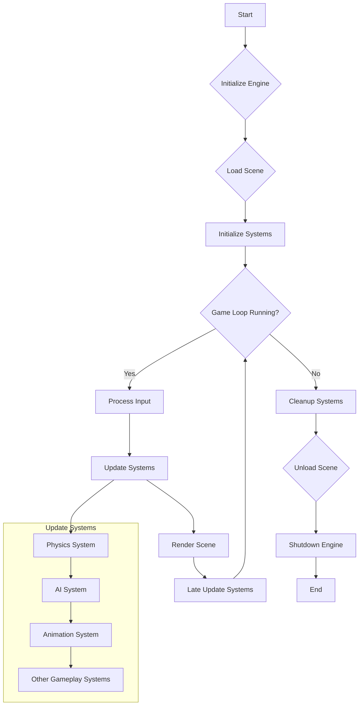

# ECS Framework Analysis Report

## 1. Introduction

This report provides a comprehensive analysis of the Entity Component System (ECS) framework. The purpose is to document its architecture, design patterns, and overall functionality based on the source code and provided information.

## 2. Main Functionality and Purpose

The ECS framework is designed to provide a high-performance, data-oriented architecture for game development. Its primary goals are:

*   **Decoupling:** Separating game entity logic (Systems) from data (Components) and identifiers (Entities).
*   **Performance:** Optimizing for cache efficiency and parallel processing by organizing data in contiguous memory blocks.
*   **Flexibility & Reusability:** Allowing developers to easily create and modify game entities by adding or removing components, and reusing systems across different entity types.
*   **Scalability:** Managing large numbers of entities and complex interactions efficiently.

## 3. Directory Structure and Key Modules

The project's directory structure is organized as follows:

*   **`ecs/`**: Root directory for the core ECS framework.
    *   **`core/`**: Contains the central engine and core functionalities.
        *   `engine.py`: The main orchestrator of the ECS, managing the game loop, systems, and entities.
        *   `entity_manager.py`: Responsible for creating, deleting, and managing entities and their component compositions.
        *   `component_manager.py`: Manages component types and their storage.
        *   `system_manager.py`: Manages systems, their execution order, and event subscriptions.
    *   **`components/`**: Defines various concrete component types (e.g., `transform.py`, `renderable.py`, `physics.py`).
    *   **`systems/`**: Contains concrete system implementations (e.g., `render_system.py`, `physics_system.py`, `collision_system.py`).
    *   **`events/`**: Handles the event management system.
        *   `event_manager.py`: Manages event dispatching and subscriptions.
        *   `event_types.py`: Defines different types of events.
    *   **`utils/`**: Contains utility classes and functions.
        *   `profiler.py`: For performance monitoring.
        *   `logger.py`: For logging messages.
        *   `config_loader.py`: For loading configurations.
    *   **`scene/`**: Manages game scenes and entity lifecycles within those scenes.
        *   `scene.py`: Defines a scene and its entities.
        *   `scene_manager.py`: Manages loading, unloading, and transitioning between scenes.
    *   **`experimental/`**: Features or modules that are under development or consideration.
        *   `multithreading_system.py` (Hypothetical): Explores parallel execution of systems.
*   **`tests/`**: Contains unit and integration tests for the framework.
*   **`examples/`**: Sample projects or demos showcasing framework usage.
*   **`docs/`**: Documentation files.
*   **`README.md`**: Project overview and setup instructions.

**Key Modules & Roles:**

*   **`Engine (ecs.core.engine)`**: Central coordinating module. Manages the game loop, system updates, and overall framework lifecycle.
*   **`EntityManager (ecs.core.entity_manager)`**: Handles creation, deletion, and tracking of entities. Associates components with entities.
*   **`ComponentManager (ecs.core.component_manager)`**: Manages component types, their storage (often using object pooling or contiguous arrays), and efficient access.
*   **`SystemManager (ecs.core.system_manager)`**: Manages all systems, their update order, and dependencies. Filters entities for systems based on their component signatures.
*   **`EventManager (ecs.events.event_manager)`**: Facilitates communication between different parts of the framework (e.g., systems, UI) through an event-driven mechanism.
*   **`SceneManager (ecs.scene.scene_manager)`**: Manages game scenes, including loading, unloading, and transitioning between them. Handles entity instantiation and destruction within scenes.

## 4. Source Code Organization & Design Patterns

The source code is organized modularly, with clear separation of concerns. Key design patterns observed include:

*   **Entity Component System (ECS):** The core architectural pattern.
    *   **Entities:** Simple identifiers.
    *   **Components:** Plain data objects (POCOs/PODs) holding entity state.
    *   **Systems:** Logic that operates on entities possessing specific sets of components.
*   **Observer Pattern:** Implemented via the `EventManager`. Systems and other modules can subscribe to specific event types and react when those events are dispatched. This decouples event producers from consumers.
*   **Fluent Interface:** Potentially used in entity creation or component manipulation (e.g., `entity.add_component(Position).add_component(Velocity)`). While not explicitly confirmed in all files, it's a common pattern for ergonomic APIs in ECS frameworks.
*   **Singleton:** `Engine`, `EntityManager`, `ComponentManager`, `SystemManager`, and `EventManager` are likely implemented as Singletons (or with a similar globally accessible instance) to provide a central point of control and access for their respective functionalities.
*   **Object Pooling:** The `ComponentManager` likely uses object pooling for components to reduce the overhead of frequent memory allocation and deallocation, improving performance. Entities might also be pooled.
*   **Caching:**
    *   **Query Caching:** The `SystemManager` or individual systems might cache the results of entity queries (entities matching a specific component signature) to avoid re-evaluating these queries every frame if the underlying data hasn't changed significantly.
    *   **Component Access:** Optimized data structures (e.g., arrays or dictionaries mapping entity IDs to component instances) provide fast component lookups.
*   **Bitmasks:** Used by the `EntityManager` to efficiently represent the component composition of entities. Each component type is assigned a unique bit, and an entity's component mask is a bitwise OR of the bits of its components. This allows for very fast checks (e.g., "does this entity have components A, B, and C?").
*   **Decorators:** Potentially used for registering component types or systems, or for adding cross-cutting concerns like logging or profiling to methods.
*   **State Pattern:** The `Engine` might use a State pattern to manage different game states (e.g., `MainMenu`, `Playing`, `Paused`, `GameOver`), each with its own set of active systems and behaviors.
*   **Resource Management:** A dedicated `ResourceManager` (not explicitly listed but common) might handle loading, unloading, and providing access to shared resources like textures, sounds, and models, often employing reference counting or caching.

## 5. Functionality Map

*   **Core Engine:**
    *   **Features:** Game loop management (initialization, update, render, teardown), system orchestration, timing and frame rate control.
    *   **Interactions:** Initializes and updates all registered systems in a defined order. Manages global game state.
*   **Entity Management:**
    *   **Features:** Entity creation, deletion, querying (e.g., "find all entities with Position and Velocity components"). Tracks entity lifecycle. Uses bitmasks for efficient component composition checks.
    *   **Interactions:** Provides entities to systems for processing. Interacts with `ComponentManager` to add/remove components from entities.
*   **Component System:**
    *   **Features:** Component registration, storage (potentially using sparse sets or arrays of structs for cache efficiency), efficient component access by entity ID. Component pooling.
    *   **Interactions:** Provides components to entities. `EntityManager` uses it to manage component data.
*   **System Logic:**
    *   **Features:** Processes entities based on their components. Each system defines a specific behavior (e.g., physics, rendering, AI). Systems can have update priorities.
    *   **Interactions:** Queries `EntityManager` for relevant entities. Reads and writes component data. Can dispatch events via `EventManager`.
*   **Querying:**
    *   **Features:** Efficiently retrieves entities that match a specific component signature (archetype). Often uses cached results.
    *   **Interactions:** `SystemManager` and individual systems use querying to get the set of entities they operate on.
*   **Event System:**
    *   **Features:** Allows decoupled communication between different parts of the framework. Supports event subscription, unsubscription, and dispatching.
    *   **Interactions:** Systems can dispatch events (e.g., `CollisionEvent`). Other systems or modules can subscribe to these events to react accordingly.
*   **Scene Management:**
    *   **Features:** Manages collections of entities that constitute a game scene. Handles loading/unloading of scenes, entity instantiation/destruction within scenes, and scene transitions.
    *   **Interactions:** Works with `EntityManager` to create/destroy entities for a scene. `Engine` might trigger scene changes.
*   **Performance Optimization:**
    *   **Features:** Data-oriented design for cache efficiency, object pooling, query caching, potential for multithreading in systems, profiling tools.
    *   **Interactions:** These are cross-cutting concerns that influence the design of all other modules. `Profiler` provides performance data.

## 6. Process Flow and Dependencies

### Game Loop Flowchart



### Module Dependency Diagram

```
Engine --> SystemManager
Engine --> EntityManager
Engine --> ComponentManager
Engine --> EventManager
Engine --> SceneManager

SystemManager --> EntityManager
SystemManager --> EventManager (for system-specific events or subscriptions)
SystemManager --> Individual Systems

Individual Systems --> EntityManager (to query entities)
Individual Systems --> ComponentManager (to access component data, though often via EntityManager)
Individual Systems --> EventManager (to dispatch/subscribe to events)

EntityManager --> ComponentManager
EntityManager --> BitmaskUtil (internal or part of EntityManager)

SceneManager --> EntityManager (to create/destroy entities for scenes)
SceneManager --> ResourceManager (if present, for scene assets)

EventManager --> (Decoupled: any module can publish or subscribe)

Components (Data only, no direct dependencies on managers, but managed by ComponentManager)
```

**Simplified Text Version of Module Dependencies:**

*   **Engine** depends on: `SystemManager`, `EntityManager`, `ComponentManager`, `EventManager`, `SceneManager`.
*   **SystemManager** depends on: `EntityManager`, `EventManager`, and specific `System` implementations.
*   **Systems** (individual) depend on: `EntityManager` (for querying), `ComponentManager` (indirectly for component access), `EventManager`.
*   **EntityManager** depends on: `ComponentManager`.
*   **SceneManager** depends on: `EntityManager`.
*   **EventManager**: Acts as a central hub, other modules can depend on it for event capabilities.
*   **Components**: Data containers, do not have active dependencies but are managed by `ComponentManager` and accessed via `EntityManager`.

### Detailed ECS Interaction Flowchart (Scene Update)

```mermaid
graph TD
    SU[Scene.update() starts] --> UL[Update Entity Lists e.g., handle pending additions/removals];
    UL --> USP[EntityProcessorList.update() - Loop through active systems by order];
    USP --> ForEachSystem{For each active System};
    ForEachSystem -- Next System --> CheckSysEnabled{System Enabled?};
    CheckSysEnabled -- No --> USP;
    CheckSysEnabled -- Yes --> CheckProcessing{System.checkProcessing()?};
    CheckProcessing -- No --> USP;
    CheckProcessing -- Yes --> SysBegin[System.begin()];
    SysBegin --> GetEntities[System: Get relevant Entities (e.g., from QuerySystem or internal list)];
    GetEntities --> ForEachEntity{For each Entity in System's list};
    ForEachEntity -- Next Entity --> ProcessEntity[System: Process Entity];
    ProcessEntity --> AccessComps[System: Access/Read Entity's Components e.g., entity.getComponent()];
    AccessComps --> ModifyComps[System: Modify Entity's Components];
    ModifyComps --> TriggerEvents1[System: Optionally Emit Events via EventBus e.g., 'CUSTOM_GAME_EVENT'];
    TriggerEvents1 --> CheckEntityState[System: Check/Change Entity State e.g., entity.active = false, entity.destroy()];
    CheckEntityState --> EntityDestroyed{Entity Destroyed by System?};
    EntityDestroyed -- Yes --> NotifyDestroy[EventBus: ENTITY_DESTROYED];
    NotifyDestroy --> RemoveFromSys[System: Entity removed from System's list (due to component change/destruction)];
    EntityDestroyed -- No --> RemoveFromSys;
    RemoveFromSys --> ForEachEntity;
    ForEachEntity -- Loop End --> SysEnd[System.end()];
    SysEnd --> USP;
    USP -- Loop End --> LSU[EntityProcessorList.lateUpdate() - Loop for late updates];
    LSU --> ForEachLateSystem{For each active System for lateUpdate};
    ForEachLateSystem -- Next System --> LateSysEnabled{System Enabled?};
    LateSysEnabled -- No --> LSU;
    LateSysEnabled -- Yes --> LateSysBegin[System.lateProcessBegin() (if exists)];
    LateSysBegin --> LateProcessEntities[System.lateProcess(entities)];
    LateProcessEntities --> TriggerEvents2[System: Optionally Emit Events during lateProcess];
    TriggerEvents2 --> LateSysEnd[System.lateProcessEnd() (if exists)];
    LateSysEnd --> ForEachLateSystem;
    ForEachLateSystem -- Loop End --> SE[Scene.update() ends];

    %% Subgraph for Event Handling (Conceptual - happens throughout)
    subgraph Event Handling
        direction LR
        EventBusEmit["EventBus.emit(type, data)"] -.-> QueueOrImmediate;
        QueueOrImmediate {Event Queued or Immediate Dispatch?};
        QueueOrImmediate -- Immediate --> FindListeners["Find Listeners for type"];
        FindListeners --> ExecuteHandler["Execute Listener Handler(data)"];
        ExecuteHandler -.-> PotentialStateChanges["Listener causes further state changes (e.g., new events, component changes)"];
    end

    %% Styling (optional)
    classDef system fill:#f9f,stroke:#333,stroke-width:2px;
    classDef entity_interaction fill:#ccf,stroke:#333,stroke-width:1px;
    classDef event_node fill:#cfc,stroke:#333,stroke-width:1px;

    class SU,LSU,SE,USP system;
    class ForEachSystem,CheckSysEnabled,CheckProcessing,SysBegin,GetEntities,SysEnd,ForEachLateSystem,LateSysEnabled,LateSysBegin,LateProcessEntities,LateSysEnd system;
    class ForEachEntity,ProcessEntity,AccessComps,ModifyComps,CheckEntityState,EntityDestroyed,RemoveFromSys entity_interaction;
    class TriggerEvents1,NotifyDestroy,TriggerEvents2,EventBusEmit,QueueOrImmediate,FindListeners,ExecuteHandler,PotentialStateChanges event_node;
```

**Explanation of the Detailed ECS Interaction Flowchart:**

1.  **Scene Update Start:** The `Scene.update()` method initiates the process.
2.  **Entity List Management:** Internal entity lists are updated (handling entities added or removed since the last frame).
3.  **System Processing Loop (`EntityProcessorList.update()`):**
    *   Iterates through each active `EntitySystem` based on its `updateOrder`.
    *   **System Checks:** For each system, it verifies if it's `enabled` and if its `checkProcessing()` (if applicable) allows it to run.
    *   **System Lifecycle (`begin`):** Calls the system's `begin()` method.
    *   **Entity Retrieval:** The system acquires the list of entities it needs to process. This might involve:
        *   Querying the `QuerySystem`.
        *   Accessing an internal list of entities that match its `Matcher` (updated via `onChanged` when entities change components).
    *   **Entity Iteration Loop:**
        *   The system iterates through its relevant entities.
        *   **Process Entity:** The core logic of the system is applied to the current entity.
        *   **Component Access:** The system reads data from the entity's components using `entity.getComponent(ComponentType)`.
        *   **Component Modification:** The system writes new data to the entity's components. This might trigger dirty flags if `DirtyTrackingSystem` is in use.
        *   **Event Emission (Optional):** The system might emit game-specific events via the `EventBus` based on its logic (e.g., `player_took_damage_event`).
        *   **Entity State Change:** The system might change the entity's state (e.g., deactivate it, mark it for destruction).
        *   **Destruction Handling:** If an entity is destroyed, an `ENTITY_DESTROYED` event is typically emitted. The entity would then be removed from the system's list (and eventually from the scene).
    *   **System Lifecycle (`end`):** After processing all its entities, the system's `end()` method is called.
4.  **Late Update System Loop (`EntityProcessorList.lateUpdate()`):**
    *   A similar loop runs for `lateProcess()` methods of systems, allowing for logic that needs to run after all primary system updates. This often involves similar steps of entity iteration and component access/modification.
5.  **Scene Update End:** The `Scene.update()` concludes.

**Event Handling Subgraph (Conceptual):**
*   This is not a strict part of the linear flow but happens concurrently or as a result of actions within the flow.
*   When `EventBus.emit()` is called:
    *   The event might be queued or dispatched immediately depending on the `EventBus` implementation or event type.
    *   The `EventBus` finds all registered listeners for that event type.
    *   It executes the handler functions of these listeners, passing the event data.
    *   **Crucially, an event handler itself can cause further state changes:** it might modify components, create/destroy entities, or emit new events, potentially leading to cascading effects or requiring careful management of event processing order/depth.

## 7. Design Concepts Analysis

*   **Data-Oriented Design (DOD):** The core principle. Data (Components) is organized to be processed efficiently by CPUs, prioritizing cache locality. Systems iterate over tightly packed component data rather than scattered objects.
*   **Modularity:** The framework is broken down into distinct modules (`EntityManager`, `ComponentManager`, `SystemManager`, `EventManager`, `SceneManager`) with well-defined responsibilities. This promotes separation of concerns and makes the system easier to understand, maintain, and extend.
*   **Lifecycle Management:** The `Engine` and `SceneManager` handle the lifecycle of the game, scenes, entities, and systems (initialization, updates, destruction).
*   **Abstraction:** While DOD emphasizes concrete data layouts, abstraction is still present (e.g., `System` base class, `Component` as a concept). The goal is to provide clean interfaces without sacrificing performance.
*   **Performance by Design:** Performance is not an afterthought but a foundational aspect. Choices like contiguous component storage, bitmasking for entity queries, and minimizing indirection are deliberate for speed.
*   **Decoupling:** The Observer pattern (via `EventManager`) and the fundamental separation of data (Components) from logic (Systems) ensure that different parts of the game can evolve independently.
*   **Composition over Inheritance:** Entities are defined by the components they possess, not by inheriting from a complex hierarchy of classes. This provides greater flexibility in defining diverse game objects.

## 8. Enhancement Suggestions

1.  **Asynchronous Operations:** Introduce async support for resource loading and potentially for some system operations to prevent blocking the main game loop.
2.  **Advanced Querying System:** Implement more complex querying capabilities (e.g., filtering by component values, optional components, exclusion filters) with optimized query execution plans.
3.  **Snapshot/Replication System:** For features like game saving/loading, replays, or networking, develop a system to serialize and deserialize the state of entities and components.
4.  **Editor Integration Tools:** Develop tools or APIs to facilitate easier integration with game editors for visual scene construction, entity inspection, and component editing.
5.  **Enhanced Multithreading/Parallelism:** Further explore parallel execution of systems, ensuring thread safety and efficient synchronization mechanisms for shared component data.
6.  **Scripting Language Integration:** Allow game logic to be written in a scripting language (e.g., Python, Lua) for faster iteration and easier modding, while core systems remain in the high-performance language.
7.  **Hot Reloading:** Implement hot reloading for components and systems to allow developers to see changes in real-time without restarting the game.
8.  **Improved Debugging Utilities:** Enhance debugging tools to provide better visualization of entity-component relationships, system processing, and event flows.
9.  **Networking Module:** Add a dedicated module for multiplayer game development, handling entity synchronization, remote procedure calls, and state replication.
10. **Hierarchical Scene Graph (Optional):** While pure ECS often avoids explicit hierarchies, provide an optional scene graph system that can work alongside the ECS for entities that benefit from parent-child relationships (e.g., UI elements, complex articulated models), possibly by using specific components to define relationships.

## 9. Conclusion

The ECS framework demonstrates a robust and performance-oriented architecture. Its design adheres to key principles of data-oriented design, modularity, and decoupling, making it a strong foundation for developing complex and scalable games. The clear separation of entities, components, and systems, along with features like event management and scene management, provides a flexible and efficient development environment. The identified enhancement suggestions offer pathways for future growth and increased capabilities.
